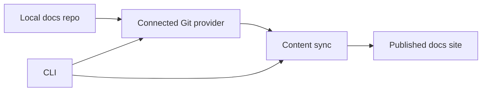

The CLI command surface is planned and not generally available yet.

Use this page as a roadmap, not as an implementation contract.

## Planned commands

| Command | Purpose | Current supported equivalent |
| --- | --- | --- |
| `dubstack login` | Authenticate the local machine. | Dashboard login and scoped Admin API keys. |
| `dubstack preview` | Start a local docs preview. | Dashboard live preview and preview deployments. |
| `dubstack validate` | Validate config, navigation, links, and specs. | CI checks plus dashboard API/spec validation. |
| `dubstack deploy` | Trigger a source-backed deployment sync. | Git push, dashboard deployment controls, or trusted webhook. |
| `dubstack open` | Open the dashboard or published docs site. | Dashboard links and site URLs. |

## Automation boundary

The CLI should not bypass the source of truth.

The intended model is still Git-backed: write to the repository, sync from the repository, and render from published content.

## Current safe automation

For automation that needs to run today, use:

- [Admin API keys](/dashboard/api-keys) for scoped trusted operations
- [CI](/deployment/ci) for validation and deployment checks
- [Webhooks and CI](/deployment/webhooks-ci) for event-driven syncs
