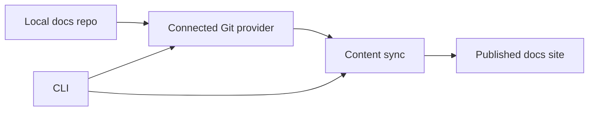

Les commandes de la CLI sont prévues, mais ne sont pas encore disponibles publiquement.

Utilisez cette page comme feuille de route, et non comme contrat d'implémentation.

## Commandes prévues

| Commande | Objectif | Équivalent actuellement pris en charge |
| --- | --- | --- |
| `dubstack login` | Authentifier la machine locale. | Connexion au tableau de bord et clés API Admin limitées par portée. |
| `dubstack preview` | Démarrer un aperçu local de la documentation. | Aperçu en direct dans le tableau de bord et déploiements d'aperçu. |
| `dubstack validate` | Valider la configuration, la navigation, les liens et les spécifications. | Vérifications CI plus validation de l'API/spécifications du tableau de bord. |
| `dubstack deploy` | Déclencher une synchronisation de déploiement basée sur la source. | Push Git, contrôles de déploiement du tableau de bord ou webhook fiable. |
| `dubstack open` | Ouvrir le tableau de bord ou le site de documentation publié. | Liens du tableau de bord et URL du site. |

## Frontière d'automatisation

La CLI ne doit pas contourner la source de vérité.

Le modèle prévu reste basé sur Git : écrire dans le dépôt, synchroniser depuis le dépôt et rendre à partir du contenu publié.

## Automatisation sécurisée actuelle

Pour l'automatisation qui doit fonctionner aujourd'hui, utilisez :

- [Clés API Admin](/fr/dashboard/api-keys) pour des opérations fiables avec portée
- [CI](/fr/deployment/ci) pour les vérifications et contrôles de déploiement
- [Webhooks et CI](/fr/deployment/webhooks-ci) pour les synchronisations déclenchées par des événements
