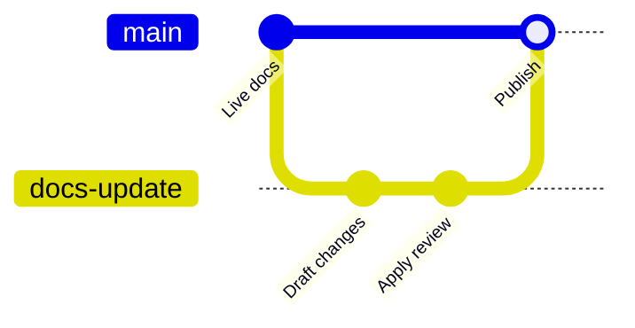

Les branches vous permettent de modifier la documentation sans modifier immédiatement le site en ligne.

Utilisez une branche lorsqu'un changement doit être révisé, prévisualisé ou testé avant d'atteindre la branche de déploiement.

## Flux de travail des branches



La branche de déploiement construit le site de documentation en direct. Une branche de fonctionnalité peut générer une prévisualisation, recevoir des commentaires de révision et ne fusionner que lorsque le changement est prêt.

## Nommer les branches clairement

Utilisez des noms courts qui décrivent le changement :

| Bon | Éviter |
| --- | --- |
| `fix-auth-guide` | `updates` |
| `add-webhook-reference` | `my-branch` |
| `seo-audit-july` | `temp` |
| `ticket-184-api-errors` | `branch1` |

Des noms de branches clairs rendent l'historique de déploiement, les liens de prévisualisation et les pull requests plus faciles à parcourir.

## Créer des branches depuis le tableau de bord

Utilisez les contrôles de branche de l'éditeur lorsque vous souhaitez rester dans le tableau de bord.

1. Ouvrez l'éditeur.
2. Sélectionnez la branche actuelle depuis la barre d'outils de l'éditeur.
3. Créez ou basculiez vers la branche que vous souhaitez éditer.
4. Enregistrez les modifications sous forme de commits.
5. Publiez directement si autorisé, ou ouvrez une pull request ou une demande de fusion si une revue est requise.

Si la protection des branches empêche la publication directe, utilisez le flux de pull request ou de fusion de votre fournisseur.

## Créer des branches localement

Utilisez votre client Git local lorsque vous préférez un flux de travail docs-as-code.

```bash
git checkout -b fix-auth-guide
git add .
git commit -m "Clarify authentication guide"
git push -u origin fix-auth-guide
```

Ensuite, ouvrez une pull request ou une demande de fusion sur votre fournisseur Git.

## Prévisualiser les modifications de branche

Les déploiements de prévisualisation permettent aux collègues de réviser la documentation avant que la branche ne soit fusionnée.

Utilisez les prévisualisations pour :

- nouvelle structure de guide
- changements de spécification OpenAPI
- changements de page d'accueil ou de navigation
- brouillons de flux de travail générés
- changements nécessitant une revue par le produit, l'ingénierie ou le support

L'URL de prévisualisation doit être considérée comme temporaire. Fusionnez la branche pour publier le changement de manière permanente.

## Dépannage

| Problème | Vérifier |
| --- | --- |
| La branche n'apparaît pas dans le tableau de bord | Vérifiez que les identifiants du fournisseur connecté peuvent lire les branches. |
| La prévisualisation ne s'actualise pas | Vérifiez que la branche a été poussée avec succès et que le travail de synchronisation est terminé. |
| La pull request ne peut pas être créée | Vérifiez que l'accès d'auteur est connecté et que la protection de la branche permet les branches créées par l'application. |
| Le site en direct a changé de manière inattendue | Vérifiez que le changement a été effectué sur la branche de déploiement, et non sur une branche de révision. |

## Sujets connexes

<RelatedTopics>
  <a href="/fr/guides/git-concepts">Concepts Git pour les documents</a>
  <a href="/fr/editor/branching-and-publishing">Gestion des branches et publication</a>
  <a href="/fr/deployment/preview-deployments">Déploiements de prévisualisation</a>
  <a href="/fr/deployment/source-control-troubleshooting">Dépannage du contrôle de source</a>
</RelatedTopics>
