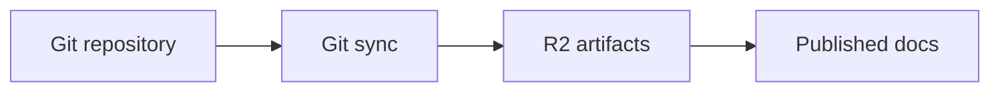

Les composants multimédias aident à expliquer les flux visuels, l'architecture et les résultats de configuration.

Stockez les ressources produit dans le dépôt de documentation pour que Git, les déploiements de prévisualisation et les documents publiés restent synchronisés.

## Images

Utilisez la syntaxe d'image Markdown pour les images simples.

```mdx

```

Utilisez le composant `Image` lorsque vous avez besoin de légendes, de sources spécifiques au thème, de cadres, d'alignement ou de contrôle de largeur.

<Image src="/logo/light.svg" darkSrc="/logo/dark.svg" alt="logo dubstack" caption="Actif logo fourni depuis le dépôt de documentation." width="40" framed />

```mdx
<Image
  src="/logo/light.svg"
  darkSrc="/logo/dark.svg"
  alt="dubstack logo"
  caption="Logo asset served from the docs repository."
  width="40"
  framed
/>
```

## Galeries

Utilisez `Gallery` lorsqu'une page doit afficher un petit ensemble de captures d'écran ou de ressources associées sur une surface dédiée.

<Gallery
  images='[
    {"src":"/logo/light.svg","alt":"logo dubstack en mode clair"},
    {"src":"/logo/dark.svg","alt":"logo dubstack en mode sombre"}
  ]'
  framed
  rounded
  width="60"
/>

```mdx
<Gallery
  images='[
    {"src":"/logo/light.svg","alt":"dubstack light logo"},
    {"src":"/logo/dark.svg","alt":"dubstack dark logo"}
  ]'
  framed
  rounded
  width="60"
/>
```

Utilisez les galeries pour les captures d'écran qui vont ensemble, comme les états d'interface avant et après ou un court flux de configuration. Décrivez chaque image avec un texte `alt` pertinent.

## Vidéo

Utilisez `Video` pour les actifs vidéo téléchargés.

```mdx
<Video src="https://cdn.example.com/docs/walkthrough.mp4" title="Dashboard walkthrough" />
```

Utilisez des ressources du dépôt ou des ressources hébergées approuvées. N'intégrez pas d'enregistrements privés sauf si la page est protégée.

## Contenus intégrés

Utilisez `Embed` pour le contenu basé sur iframe tel que des démonstrations de produit, des diagrammes ou des démos externes approuvées.

```mdx
<Embed url="https://www.youtube.com/watch?v=example" title="Product walkthrough" />
```

<Callout type="warning">
  Intégrez uniquement du contenu auquel vous faites confiance. Les pages intégrées peuvent charger des scripts depuis le fournisseur.
</Callout>

## Diagrammes Mermaid

Utilisez un bloc de code encadré Mermaid pour les diagrammes.



````mdx

````

Les grands diagrammes incluent automatiquement des contrôles de défilement et de zoom lorsqu'ils sont nécessaires.

## Propriétés

<ResponseField name="src" type="string">
  Chemin ou URL de l'actif pour `Image` et `Video`.
</ResponseField>

<ResponseField name="darkSrc" type="string">
  Source d'image en mode sombre facultatif.
</ResponseField>

<ResponseField name="caption" type="string">
  Légende d'image facultative.
</ResponseField>

<ResponseField name="framed" type="boolean" default="false">
  Ajoute un cadre subtil autour de l'image.
</ResponseField>

<ResponseField name="align" type="string" default="center">
  Prise en charge de `left`, `center` et `right`.
</ResponseField>

<ResponseField name="width" type="number">
  Largeur en pourcentage entre le minimum et le maximum pris en charge.
</ResponseField>

<ResponseField name="images" type="string">
  Chaîne JSON d'objets d'images pour `Gallery`. Chaque élément doit inclure `src` et `alt`.
</ResponseField>

<ResponseField name="rounded" type="boolean" default="false">
  Arrondit les coins des images de galerie.
</ResponseField>

<ResponseField name="url" type="string">
  URL utilisée par `Embed`.
</ResponseField>

<ResponseField name="title" type="string">
  Titre accessible pour les vidéos et les embeds.
</ResponseField>

## Directives

- Ajoutez un texte descriptif `alt` pour les images.
- Maintenez les captures d'écran à jour avec l'interface utilisateur du produit.
- Utilisez des galeries uniquement lorsque les images forment une séquence ou une comparaison.
- Utilisez des diagrammes pour l'architecture et les flux, et non du contenu décoratif.
- Évitez d'intégrer des outils internes privés ou non authentifiés dans les documents publics.
