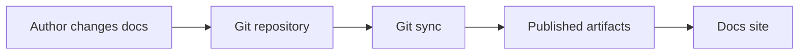
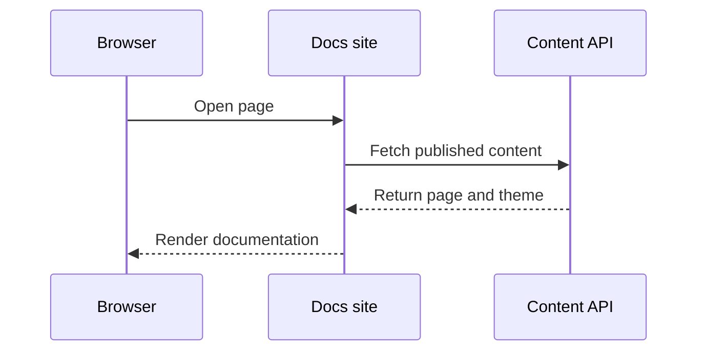
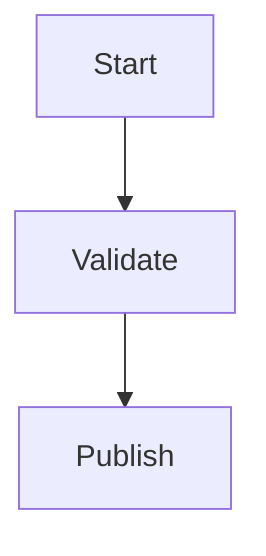
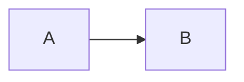

Utilisez les diagrammes Mermaid pour les flux plus faciles à comprendre visuellement : pipelines de déploiement, flux de données, transferts d'authentification et relations entre services.

dubstack rend les blocs encadrés `mermaid` en diagrammes et conserve la source originale dans Git.

## Diagramme de flux



````mdx

````

## Diagramme de séquence



````mdx

````

## Contrôles de diagramme

Les grands diagrammes affichent automatiquement les contrôles de défilement et de zoom. Vous pouvez forcer l'affichage ou la suppression des contrôles avec les métadonnées de bloc.

````mdx

````

Utilisez `controls=hide` pour les petits diagrammes qui doivent rester statiques.

````mdx

````

## Métadonnées

<ResponseField name="controls" type="string" default="auto">
  Contrôle de visibilité. Les valeurs prises en charge sont `auto`, `show` et `hide`.
</ResponseField>

<ResponseField name="placement" type="string" default="bottom-right">
  Contrôle de position. Les valeurs prises en charge sont `top-left`, `top-right`, `bottom-left` et `bottom-right`.
</ResponseField>

## Directives

- Privilégiez les diagrammes pour les processus et l'architecture, pas pour la décoration.
- Maintenez les étiquettes des nœuds courtes pour que les diagrammes restent lisibles sur mobile.
- Placez les explications longues avant ou après le diagramme, plutôt que dans les nœuds.
- Utilisez les diagrammes de séquence pour les flux de requêtes et les diagrammes de flux pour les étapes du cycle de vie.
