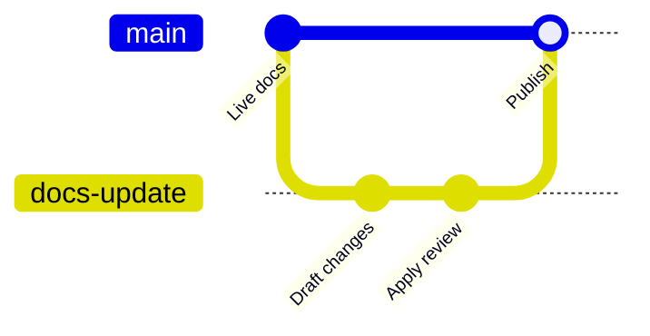

Branches let you make documentation changes without immediately changing the live site.

Use a branch when a change should be reviewed, previewed, or tested before it reaches the deployment branch.

## Branch workflow



The deployment branch builds the live docs site. A feature branch can build a preview, receive review comments, and merge only when the change is ready.

## Name branches clearly

Use short names that describe the change:

| Good | Avoid |
| --- | --- |
| `fix-auth-guide` | `updates` |
| `add-webhook-reference` | `my-branch` |
| `seo-audit-july` | `temp` |
| `ticket-184-api-errors` | `branch1` |

Clear branch names make deployment history, preview links, and pull requests easier to scan.

## Create branches from the dashboard

Use the editor branch controls when you want to stay inside the dashboard.

1. Open the editor.
2. Choose the current branch from the editor toolbar.
3. Create or switch to the branch you want to edit.
4. Save changes as commits.
5. Publish directly when allowed, or open a pull request or merge request when review is required.

If branch protection prevents direct publishing, use the provider pull request or merge request flow.

## Create branches locally

Use your local Git client when you prefer a docs-as-code workflow.

```bash
git checkout -b fix-auth-guide
git add .
git commit -m "Clarify authentication guide"
git push -u origin fix-auth-guide
```

Then open a pull request or merge request in your Git provider.

## Preview branch changes

Preview deployments let teammates review docs before the branch merges.

Use previews for:

- new guide structure
- OpenAPI spec changes
- homepage or navigation changes
- generated workflow drafts
- changes that need product, engineering, or support review

The preview URL should be treated as temporary. Merge the branch to publish the change permanently.

## Troubleshooting

| Problem | Check |
| --- | --- |
| Branch does not appear in the dashboard | Confirm the connected provider credential can read branches. |
| Preview does not update | Confirm the branch pushed successfully and the sync job completed. |
| Pull request cannot be created | Confirm authoring access is connected and branch protection permits app-created branches. |
| Live site changed unexpectedly | Confirm the change was made on the deployment branch, not a review branch. |

## Related topics

<RelatedTopics>
  <a href="/guides/git-concepts">Git concepts for docs</a>
  <a href="/editor/branching-and-publishing">Branching and publishing</a>
  <a href="/deployment/preview-deployments">Preview deployments</a>
  <a href="/deployment/source-control-troubleshooting">Source control troubleshooting</a>
</RelatedTopics>
