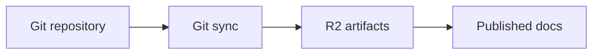

Media components help explain visual workflows, architecture, and configuration results.

Store product assets in the docs repository so Git, preview deployments, and published docs stay in sync.

## Images

Use Markdown image syntax for simple images.

```mdx

```

Use the `Image` component when you need captions, theme-specific sources, framing, alignment, or width control.

<Image src="/logo/light.svg" darkSrc="/logo/dark.svg" alt="DubStack logo" caption="Logo asset served from the docs repository." width="40" framed />

```mdx
<Image
  src="/logo/light.svg"
  darkSrc="/logo/dark.svg"
  alt="DubStack logo"
  caption="Logo asset served from the docs repository."
  width="40"
  framed
/>
```

## Galleries

Use `Gallery` when a page needs to show a small set of related screenshots or assets in one focused surface.

<Gallery
  images='[
    {"src":"/logo/light.svg","alt":"DubStack light logo"},
    {"src":"/logo/dark.svg","alt":"DubStack dark logo"}
  ]'
  framed
  rounded
  width="60"
/>

```mdx
<Gallery
  images='[
    {"src":"/logo/light.svg","alt":"DubStack light logo"},
    {"src":"/logo/dark.svg","alt":"DubStack dark logo"}
  ]'
  framed
  rounded
  width="60"
/>
```

Use galleries for screenshots that belong together, such as before-and-after UI states or a short setup flow. Keep each image descriptive with `alt` text.

## Video

Use `Video` for uploaded video assets.

```mdx
<Video src="/assets/walkthrough.mp4" title="Dashboard walkthrough" />
```

Use repository assets or approved hosted assets. Do not embed private recordings unless the page is protected.

## Embeds

Use `Embed` for iframe-based content such as product walkthroughs, diagrams, or approved external demos.

```mdx
<Embed url="https://www.youtube.com/watch?v=example" title="Product walkthrough" />
```

<Callout type="warning">
  Only embed content you trust. Embedded pages can load scripts from the provider.
</Callout>

## Mermaid diagrams

Use a Mermaid fenced code block for diagrams.



````mdx

````

Large diagrams include pan and zoom controls automatically when needed.

## Props

<ResponseField name="src" type="string">
  Asset path or URL for `Image` and `Video`.
</ResponseField>

<ResponseField name="darkSrc" type="string">
  Optional dark-mode image source.
</ResponseField>

<ResponseField name="caption" type="string">
  Optional image caption.
</ResponseField>

<ResponseField name="framed" type="boolean" default="false">
  Adds a subtle frame around the image.
</ResponseField>

<ResponseField name="align" type="string" default="center">
  Supports `left`, `center`, and `right`.
</ResponseField>

<ResponseField name="width" type="number">
  Percentage width between the supported minimum and maximum.
</ResponseField>

<ResponseField name="images" type="string">
  JSON string of image objects for `Gallery`. Each item should include `src` and `alt`.
</ResponseField>

<ResponseField name="rounded" type="boolean" default="false">
  Rounds the gallery image corners.
</ResponseField>

<ResponseField name="url" type="string">
  URL used by `Embed`.
</ResponseField>

<ResponseField name="title" type="string">
  Accessible title for videos and embeds.
</ResponseField>

## Guidelines

- Add descriptive `alt` text for images.
- Keep screenshots current with the product UI.
- Use galleries only when the images form a sequence or comparison.
- Use diagrams for architecture and flows, not decorative content.
- Avoid embedding private or unauthenticated internal tools on public docs.
