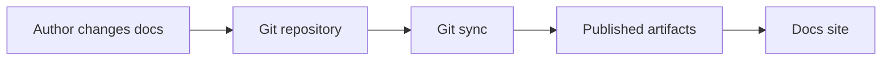
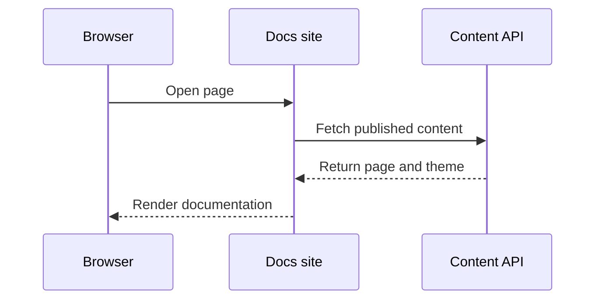
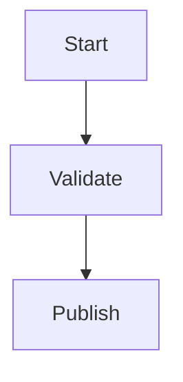
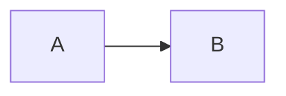

Use Mermaid diagrams for flows that are easier to understand visually: deployment pipelines, data flow, auth handoffs, and service relationships.

dubstack renders fenced `mermaid` blocks as diagrams and keeps the original source in Git.

## Flowchart



````mdx

````

## Sequence diagram



````mdx

````

## Diagram controls

Large diagrams show pan and zoom controls automatically. You can force controls on or off with fence metadata.

````mdx

````

Use `controls=hide` for small diagrams that should stay static.

````mdx

````

## Metadata

<ResponseField name="controls" type="string" default="auto">
  Controls visibility. Supported values are `auto`, `show`, and `hide`.
</ResponseField>

<ResponseField name="placement" type="string" default="bottom-right">
  Controls position. Supported values are `top-left`, `top-right`, `bottom-left`, and `bottom-right`.
</ResponseField>

## Guidelines

- Prefer diagrams for process and architecture, not decoration.
- Keep node labels short so diagrams remain readable on mobile.
- Put long explanations before or after the diagram instead of inside nodes.
- Use sequence diagrams for request flows and flowcharts for lifecycle steps.
